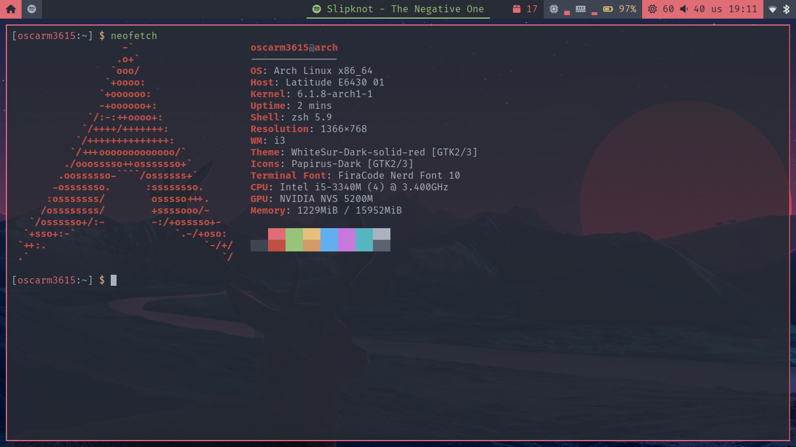

# OscarM3615 dotfiles



## Requirements

### Packages

- git
- zsh
- i3 (gaps)
  - dunst
  - QTerminal
  - picom
  - rofi
  - xautolock
  - gnome-keyring-daemon
  - amixer
  - playerctl
  - brightnessctl
  - loginctl
  - flameshot
  - feh
  - nm-applet
  - blueman-applet
- betterlockscreen
- polybar
  - pacman-contrib
  - dbus-python
- ranger

### Fonts

- Fira Code Nerd Font
- Noto Fonts
- Noto Fonts CJK
- Font Awesome
- TTF Unifont

## Installation

Clone the repo into the home folder.

```sh
git clone https://github.com/OscarM3615/dotfiles.git .dotfiles
```

Install OhMyZSH following [its instructions](https://ohmyz.sh/).

Link the dotfiles with the following commands:

```sh
ln -s ~/.dotfiles/.xprofile ~

ln -s ~/.dotfiles/betterlockscreen/betterlockscreenrc ~/.config/

ln -s ~/.dotfiles/dunst/ ~/.config/dunst/

ln -s ~/.dotfiles/i3/ ~/.config/i3/

ln -s ~/.dotfiles/neofetch/ ~/.config/neofetch/

ln -s ~/.dotfiles/omz/.zshrc ~/.zshrc
ln -s ~/.dotfiles/omz/oscarm3615.zsh-theme ~/.oh-my-zsh/custom-themes/

ln -s ~/.dotfiles/picom/ ~/.config/picom/

ln -s ~/.dotfiles/polybar/ ~/.config/polybar/

mkdir -p ~/.config/qterminal/
mv ~/.dotfiles/qterminal/qterminal.ini ~/.config/qterminal/
sudo mv ~/.dotfiles/qterminal/OneDark.colorscheme /usr/share/qtermwidget5/color-schemes/

ln -s ~/.dotfiles/ranger/ ~/.config/ranger/

mkdir -p ~/.config/rofi/
ln -s ~/.dotfiles/rofi/config.rasi ~/.config/rofi/
mv ~/.dotfiles/rofi/onedark.rasi ~/.local/share/rofi/themes/
```

## Recommended

Install vim and its own settings.

Install vim:

```sh
# Install dependencies
sudo pacman -S nodejs npm yarn

# Install vim
sudo pacman -S vim

# Alternative, to enable X11 support
sudo pacman -S gvim
```

Clone the repo:

```sh
git clone https://github.com/OscarM3615/vim.git .vim
```

Open vim and the plugins will install automatically.

```sh
vim
```
